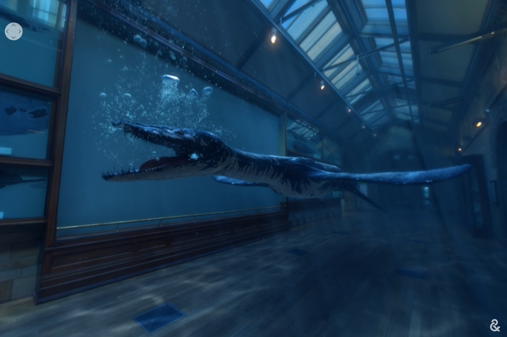
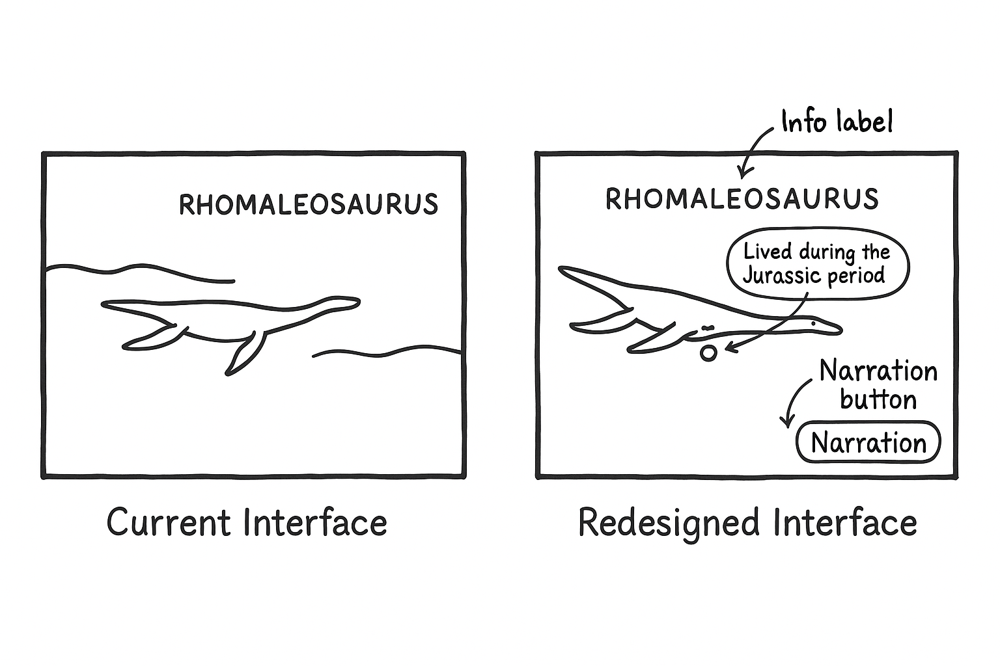

1. Describe the Context

I reviewed ‘Bringing Rhomaleosaurus SEA DRAGONS back to LIFE with 360 VR’, a 360-degree immersive video experience hosted on Google Arts & Culture’s YouTube channel. The experience falls under the 360 VR category, not fully interactive AR or VR with hotspots, but still offering a panoramic, exploratory environment meant to educate and immerse.

2. I Like / I Wish / What If

I Like:

The cinematic, realistic rendering of the Rhomaleosaurus felt engaging and informative.

The underwater environment created a compelling sense of scale and motion, helping contextualize the creature in its natural habitat.

I Wish:

I wish there were hotspots or annotations, which would provide factual pop-ups about the creature’s anatomy, behavior, or discovery location.

I wish there were educational textboxes to learn more about the Rhomaleosaurus, rather than relying on the vocal educational narration alone to guide the experience.

What If:

What if the experience allowed user interaction, such as choosing camera angles or triggering animations through gaze-based selection?

What if you could toggle information layers to learn more about the Jurassic sea, fossil excavation, and paleontology?

3. Design Guidelines Critique

The video provides passive immersion, but lacks interaction feedback. There are no affordances to explore or dive deeper. The visual fidelity is excellent throughout, but the lack of expanded educational overlays through interaction may hinder learning. Viewers who rely on audio narration or text prompts may find the experience limited in accessibility.

4. Ethics, Privacy, and Safety

Users passively receive the experience. Giving choice, such as layers of information (for example, the educational narration and picture display of other sea dragons) or interaction modes (for example, following the Rhomaleosarus), would empower exploration. The experience does not explain whether any data is collected (since it’s on YouTube). Consider mentioning how XR ethics extend to platforms hosting these videos.
The motion is mostly slow and fluid, reducing motion sickness. However, fast scene changes might affect sensitive users.

6. Screenshots

Screenshot 1: Museum View with Fossil Display

This static museum view sets the scene. The fossil is mounted on the wall with a scale label ("7m") and name annotation. It offers passive information without much interaction.

Screenshot 2: Rhomaleosaurus Comes Alive

The Rhomaleosaurus is shown swimming where the fossil once lay, which is a dramatic moment of transformation. This elevates user engagement by replacing a static exhibit with a dynamic XR visualization.

7. High-Fidelity Sketches

Current view: Show the floating sea dragon in an underwater setting with no UI.

Improved view: Show your proposed design with floating info labels, gaze-based selection reticle, and narration toggle button.

