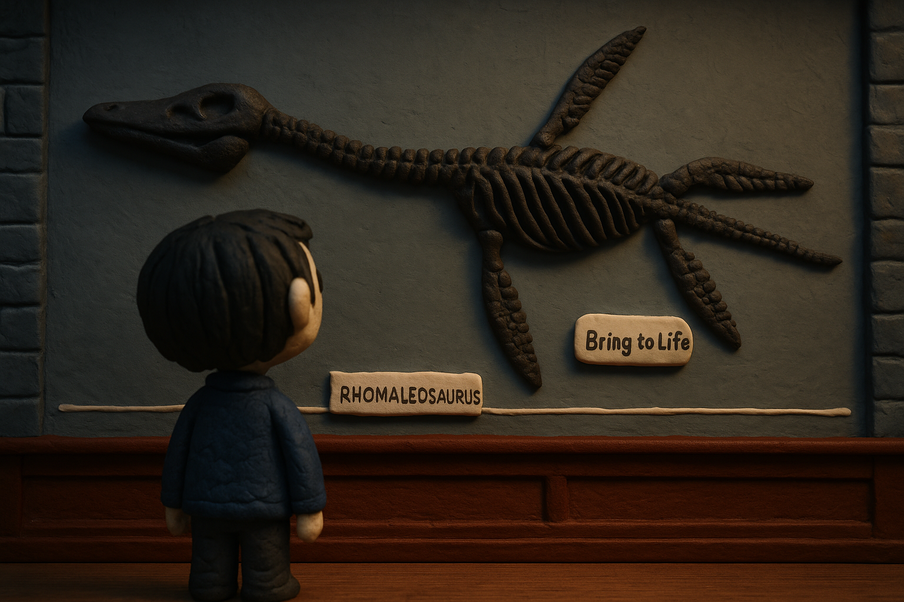
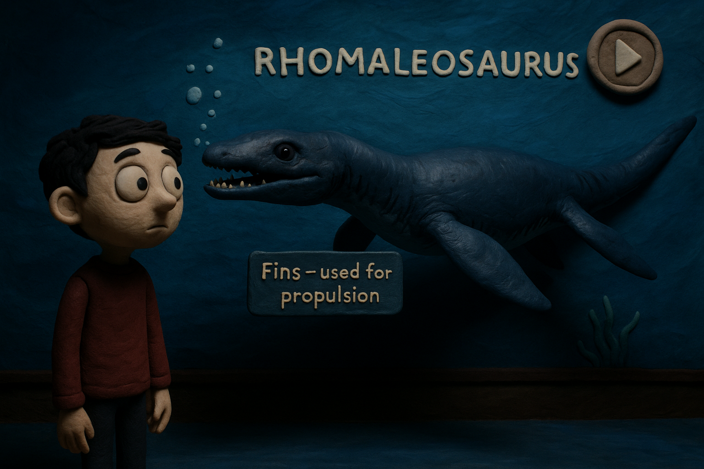
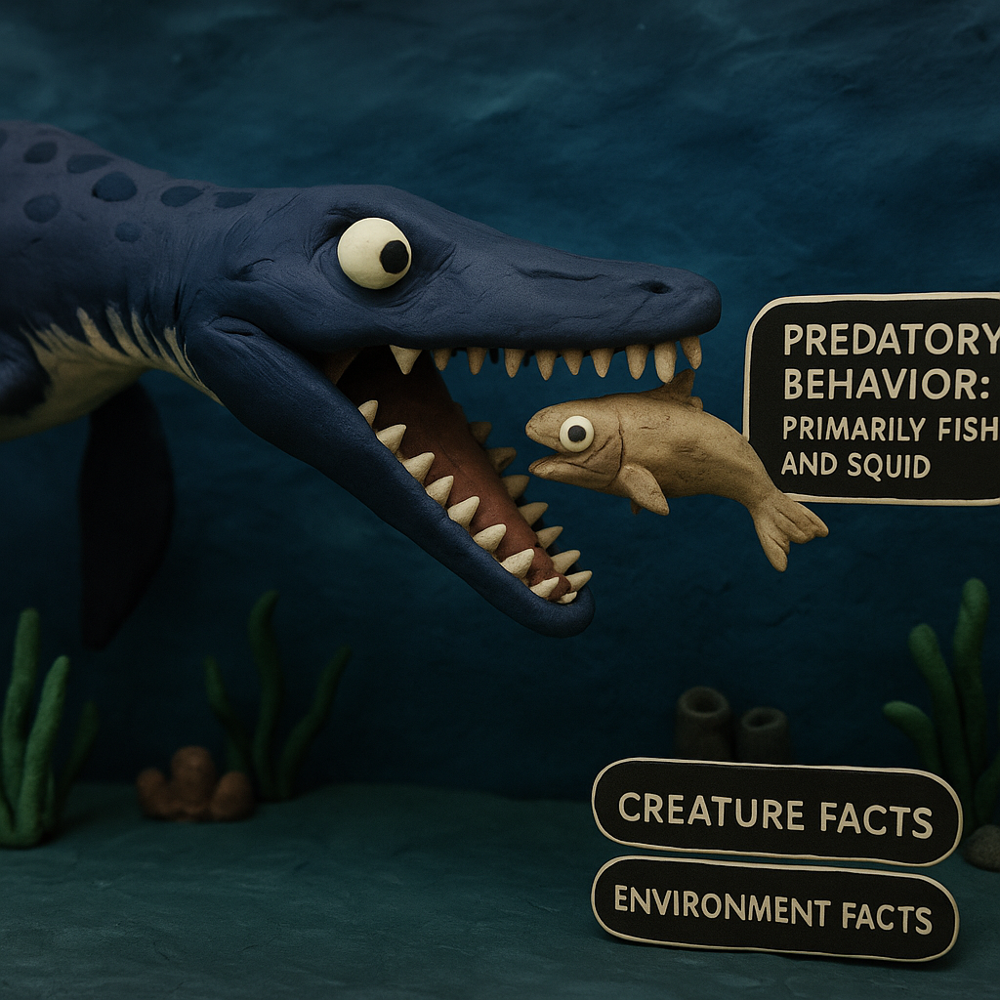

Same description as the Storyboard. Items used were toys, clay, and a high-quality camera. I also have a friend who works at a claymation studio and wanted to help me out with this.

Scene 1 – Museum Fossil Exhibit (Starting Point)
User stands in front of a mounted Rhomaleosaurus skeleton with a scale marker and nameplate. A floating button or gaze cue labeled “Bring to Life”. The purpose is to set the context, connect XR to a traditional museum environment. The new idea highlights the interactive toggle between fossil and living creature view.

Scene 2 – Transformation to Living Creature
Skeleton dissolves into a full 3D animated Rhomaleosaurus, swimming slowly across a 360° underwater scene.
The user can move their gaze to trigger floating info labels (e.g., “Fins used for propulsion”). An optional narration button explains the transformation and history. The purpose is to provide an immersive educational moment bridging static fossil to life-like reconstruction. The new idea highlights the layered information system, which overlays appear on demand instead of cluttering the view.

Scene 3 – Predator in Action
Rhomaleosaurus hunts and eats a fish in front of the user. Info overlay appears, for example, “Predatory behavior: primarily fish and squid.” The user can toggle to view “Environment Facts” about the Jurassic sea. The purpose is to move from passive viewing to interactive learning. The new idea highlights user choice which allows toggle between “Creature Facts” and “Environment Facts.”

