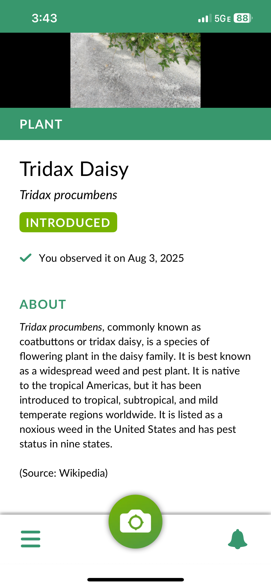

When analyzing the AR app Seek by iNaturalist, several classes of issues are particularly relevant. These issues, such as technical performance, design and usability, user adoption, and social/ethical impacts, form a comprehensive framework for evaluating Seek. Seek relies heavily on computer vision and machine learning to identify species in real-time using a mobile camera. Ensuring the accuracy and speed of these identifications is crucial to the app’s value and credibility. Performance issues such as battery drain, processing lag, and device compatibility can significantly impact user experience. GPS and camera integration need to function smoothly across a wide range of smartphones and environments. For example, low light or remote areas. The app targets a broad user base, including children, casual nature observers, and educators, so the interface must be intuitive and accessible. The user journey, from opening the app to successfully identifying a species, needs to be simple and satisfying. Visual feedback, such as animations and progress indicators, is key in an AR-based interface to keep users engaged and informed. To fulfill its educational and environmental mission, Seek must attract and retain a diverse group of users. Features like badges, challenges, and rewards support ongoing engagement, but must be balanced to avoid gamification overshadowing learning. Offline functionality is important for users in nature settings without data service, which can affect adoption in remote areas. There are privacy concerns related to camera use and location tracking. Promoting responsible interaction with wildlife is important because users may be tempted to disturb animals or habitats for a better shot. There's a broader question of data ownership and how user-collected biodiversity data is shared or stored.

I chose the object recognition think-aloud activity because it allowed me to step into the user’s perspective and closely examine how Seek by iNaturalist supports (or fails to support) the object identification process. This activity provided valuable insights into both the technical performance and the user experience of the app, which are core to its effectiveness. By interacting with the app in a natural setting like a park or backyard, I was able to simulate how a typical user would explore their environment and use Seek to identify plants, insects, or animals. This grounded the analysis in actual user behavior and environmental conditions. The activity let me directly observe how well the augmented reality and camera-based object recognition features performed, especially in variable lighting, movement, or background conditions. These are critical technical aspects of Seek’s core functionality. Using the think-aloud method allowed me to capture my thoughts, confusion points, expectations, and mental model while using the app. This helped identify areas where instructions could be clearer, feedback was lacking, and cognitive load could be reduced. By manually attempting to recognize the object myself, I could compare my reasoning with the app’s identification process. This provided a deeper understanding of how the app supports learning and whether it provides meaningful information beyond just a name. The process revealed emotional reactions helping assess the app’s engagement value and potential barriers to continued use. For example, satisfaction when a correct match was found, or frustration when the app failed to identify something.

Who: casual users and nature enthusiasts, educators and students, children and young learners, and rural or low-connectivity users.

What/Why: The problem would be inconsistent object recognition accuracy and lack of clear feedback during the scanning process. For example, a user tries to scan a native plant, but the app takes too long, gives an uncertain result, or fails without explanation. This can lead to frustration, loss of trust, and reduced educational value, especially if the user doesn’t understand what went wrong such as poor lighting or partial image.

When/Where: It would provide the most severe impact under these conditions. Before use, users in remote areas without internet or GPS may not be able to use core features. During use, while scanning, issues like slow response time, unclear instructions, or failure to recognize objects can cause frustration or confusion. After use, inaccurate or overly general identifications, such as “flower” instead of species name, reduce learning value and may discourage future use.

For users, the impact could be mitigated by offering in-app tips such as “try moving closer” or “use better lighting”, when recognition fails, including offline mode or cached data for common species in the user’s region, and allowing users to submit photos for community review via iNaturalist integration.

For designers, the impact could be mitigated by improving real-time feedback such as progress indicators or visual cues, adding confidence scores or labels, such as “Likely match” vs. “Possible match”, to manage user expectations, designing a more kid-friendly mode with simplified UI and gamified learning prompts, and conducting more usability testing with diverse user groups such ad kids, educators, or low-tech users.

